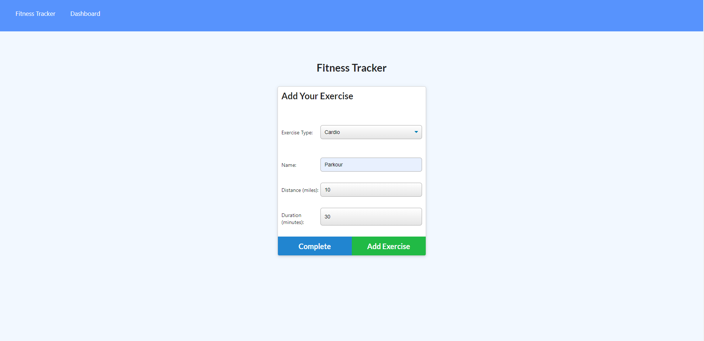
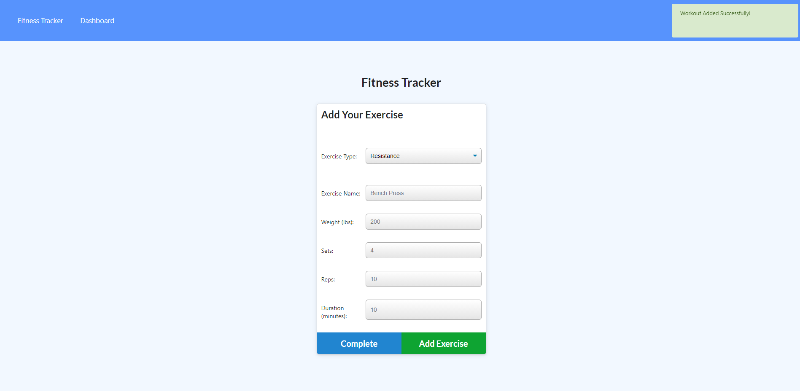
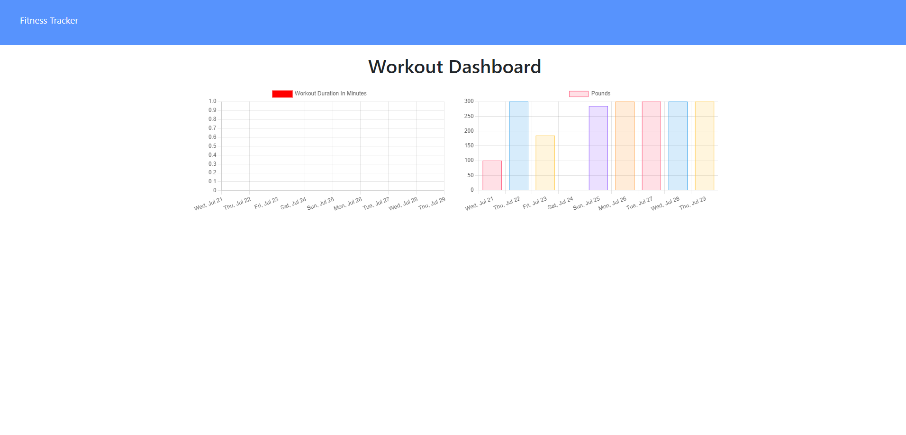

# Workout-Tracker

# Description

A workout tracker helps users to stay focuses on what's important to reach their goal. It helps users keep track of their goals, past workouts, and helps them plan their workout each day. Also having a visual progress can be advantageous for users!

# User Story

As a user, I want to be able to view create and track daily workouts. I want to be able to log multiple exercises in a workout on a given day. I should also be able to track the name, type, weight, sets, reps, and duration of exercise. If the exercise is a cardio exercise, I should be able to track my distance traveled.

# Considerations

Ensuring that buttons and data are being saved appropriately on your application. Another item to consider is ensuring your models are fully completed with correct syntax. In addition to fully fleshing out your models folder and testing each thoroughly.

# Acceptance Criteria

When the user loads the page, they should be given the option to create a new workout or continue with their last workout.

The user should be able to:

- Add exercises to the most recent workout plan.

- Add new exercises to a new workout plan.

- View the combined weight of multiple exercises from the past seven workouts on the stats page.

- View the total duration of each workout from the past seven workouts on the stats page.

# Contributors

Angelica Sargent

# Screenshot

# Link

Check out this [link](https://radiant-thicket-00167.herokuapp.com/)!